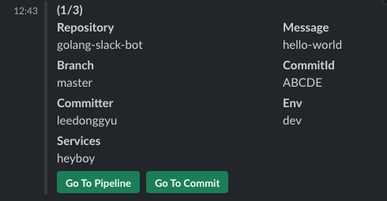

# Slack Noti Job

## Description

- CodePipeline 내에 사용될 Slack WebHook 입니다

```sh
    ## dev, prod bucket 배포
    make upload
```

## Dependency

- github.com/ashwanthkumar/slack-go-webhook
- go get -u github.com/spf13/cobra@latest
- go get github.com/spf13/viper

## 실행방법

```sh
    ## for linux / window
    make build

    ## for mac
    make build-arm

    ## move to local
    mv slack /usr/local/bin

    slack --help
```


